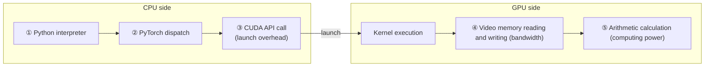
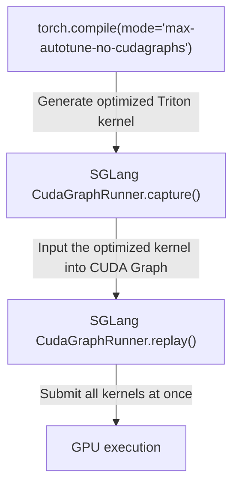
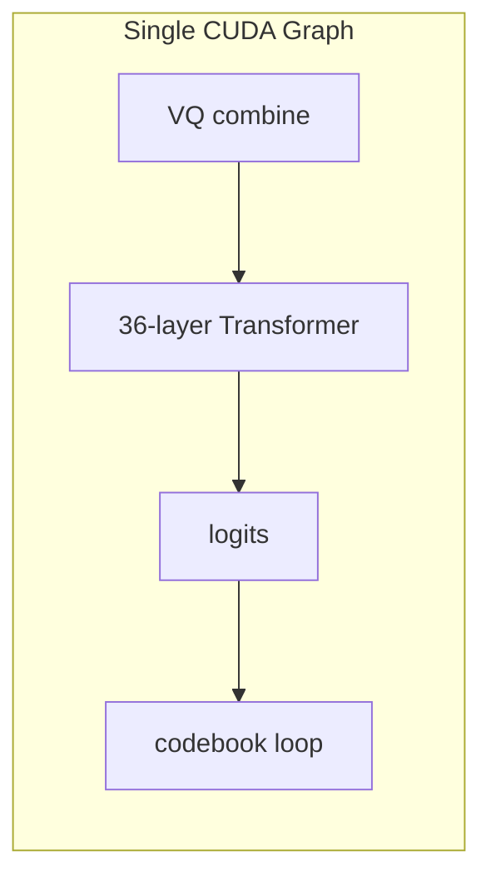
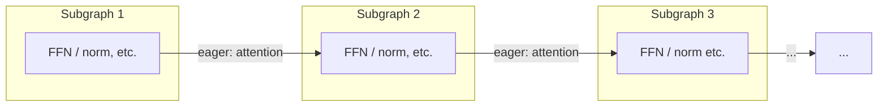

## SGLang CudaGraphRunner source code reading

The first two chapters show how CUDA Graph constraints are implemented into specific code design from the perspective of S2-Pro. Now let's take a high-level view and see how the SGLang framework manages these graphs.

Review the two key conclusions deduced in Chapter 1: **One graph can only serve one batch size** (so one needs to be captured for multiple bs), and **Multiple graphs can share the memory pool** (otherwise the video memory usage is N times high-water mark). `CudaGraphRunner` is the source code level implementation of these two concepts.

### Graph management of multiple Batch Sizes

SGLang's `CudaGraphRunner` maintains an independent `cudaGraphExec_t` for each batch size - this is a direct reflection of the "one bs, one graph" inference. The default capture_bs list contains 12 batch sizes (such as `[1, 2, 4, 8, 12, 16, 24, 32, 40, 48, 56, 64]`).

**Capture order**: from large to small - this comes from the inference of the memory pool sharing mechanism in Chapter 1. Capture the big bs first, so that the memory pool can see the maximum video memory demand. Subsequent capture of the small bs can reuse the allocated memory:

```python
# Key logic in cuda_graph_runner.py capture()
capture_range = reversed(self.capture_bs) # From large bs to small bs
for bs in capture_range:
    graph, output_buffers = self.capture_one_batch_size(bs, forward)
    self.graphs[bs] = graph
    self.output_buffers[bs] = output_buffers
```

Each bs does a **warmup run** (eager forward) before capture, triggering all possible memory allocations (cuBLAS workspace, attention buffer, etc.) to ensure that there will be no unexpected allocations during capture - this corresponds to "no dynamic memory allocation" among the five constraints.

### Memory Pool Sharing

Chapter 1 has discussed in depth the memory sharing mechanism of CUDA Graph (high-water mark, internal and external isolation, `pool=...`). In `CudaGraphRunner`, this is reflected in the fact that all bs graphs share the same pool:

```python
with self.device_module.graph(cuda_graph=graph, pool=pool, stream=stream):
    out = run_once_fn()
```
For S2-Pro, 12 bs graphs share the KV cache intermediate result memory of the audio decoder - the video memory overhead is only equivalent to one high-water mark of the largest bs graph, rather than 12 copies.

### BS Padding in Replay

When actual batch size < captured batch size, `CudaGraphRunner` will find the smallest captured bs that is greater than or equal to actual bs:

```python
index = bisect.bisect_left(self.capture_bs, raw_bs)
bs = self.capture_bs[index]
```
Graph replay executes the complete `captured_bs` kernels, and extra lines produce invalid calculations. For S2-Pro, padding means that `_decode_codebooks()` will also perform a full 9-step codebook loop for the padding lines - but since the codebook loop is a small matrix operation, the additional overhead is minimal.

### S2-Pro additional requirements for Capture

When `text_model._vq_ready = True`, the forward of capture includes VQ embedding combination, 36-layer Transformer, logits calculation, and constrained sampling + 9-step codebook loop of `_decode_codebooks()`. The Graph contains about `36 × 4 (transformer GEMM) + 9 × N (codebook loop kernels)` kernel nodes - significantly larger than the graph of ordinary LLM, but the replay overhead is still one `cudaGraphLaunch()`.

### When to Fallback to Eager Mode

Not all situations can use CUDA Graph. For S2-Pro:

- **Prefill phase**: The sequence length is not fixed → no graph is used
- **Decode phase bs exceeds maximum capture bs** → fallback
- **Chunked prefill** → No graph
- **Extend mode** → go eager

CUDA Graph mainly accelerates the steady-state throughput of the decode stage - which happens to be the performance bottleneck of S2-Pro.

## The deep relationship between CUDA Graph and torch.compile

Looking back at the benchmark table at the beginning: CUDA Graph only reaches 88 tok/s, but partial compile can increase it by 36% to 121 tok/s. CUDA Graph has eliminated all kernel launch overhead - so where does this 36% increase come from? This shows that **CUDA Graph cannot eliminate the overhead that someone else has**. To answer this question, a more complete model of GPU execution overhead needs to be developed.

### Five layers of overhead of GPU execution pipeline



| Overhead layer | The effect of CUDA Graph | The effect of torch.compile |
|---|---|---|
| ①Python overhead | **Completely eliminated** | Significantly reduced |
| ②Frame dispatch | **Complete elimination** | Significant reduction |
| ③launch overhead | **completely eliminated** | partially reduced (the number of kernels is reduced after fusion) |
| ④Video memory bandwidth | No impact | **Significant optimization** (operator fusion reduces intermediate tensor reading and writing) |
| ⑤ Arithmetic calculation | Does not affect | May be optimized (maybe worse) |

**Key Insight**: There is overlap between the two on ③, but only torch.compile works on ④. This explains why CUDA Graph + torch.compile still has a 36% increase - the small operator chain of the codebook loop still has a large number of intermediate tensor memory reads and writes.

### Why SGLang uses `max-autotune-no-cudagraphs`

In the last chapter, we read in detail SGLang's `CudaGraphRunner` - it manages the capture/replay, memory pool, and multi-bs scheduling of the graph by itself. If the inductor also performs graph capture on its own (`reduce-overhead` or `max-autotune` mode), there will be a conflict of **"graph inside graph"**. Therefore, SGLang chooses the `no-cudagraphs` suffix: let the inductor be only responsible for **kernel optimization** (operator fusion + Triton autotune), and **graph management** is left to SGLang itself:



We leave more in-depth discussions on the CUDAGraph Trees mechanism, `fullgraph=True` constraint, graph recording compatibility of inductor Triton kernel, etc. for subsequent articles.

## The rise and fall of torch.compile in S2-Pro

The previous chapter established the five-layer overhead model and the division of labor principle of `no-cudagraphs`. This chapter uses the actual iteration process and benchmark data of PR #153 to **validate** this model.

### Narrative lines of seven commits

| Serial number | Commit | Content | Meaning |
|---|---|---|---|
| 1 | `c153ae9` | unified slow/fast head | Core implementation: unified forward + persistent buffers |
| 2 | `f621355` | lint | Code specification |
| 3 | `c962aa6` | torch.compile added in | **Turning point**: Added `enable_torch_compile = True` |
| 4 | `78aafc7` | setup_vq_decode before CUDA graph capture | **Critical fix**: deferred graph capture |
| 5 | `dccf122` | tts eval refactoring | Benchmark refactoring |
| 6 | `cf9396d` | export server output | Output interface adjustment |
| 7 | `20be04a` | acknowledge torch.compile discussion | **Final decision**: Remove torch.compile |

Commit 3 added `server_args.enable_torch_compile = True`, causing the **entire model forward** to be taken over by the inductor - a benchmark of 18 candidate kernels for each GEMM shape of 36 layers of transformer × 12 bs. Boot time ballooned from 33s to 137s.

### Benchmark data interpretation

| Configuration | Health Ready | Graph Capture | Throughput (TTS) | Throughput (Voice Clone) |
|---|---|---|---|---|
| CUDA Graph only | 33.3s | 3.3s | 88.1 tok/s | 87.7 tok/s |
| Partial compile (fast head only) | 54.4s | 16.4s | 120.6 tok/s | 118.7 tok/s |
| Full-model compile | 137.0s | 107.0s | 125.7 tok/s | 122.5 tok/s |Use the five-layer overhead model established in the previous chapter to interpret these data one by one:

Where does the 36% throughput improvement of,
1. **Partial compile come from? ** Review the five-layer overhead table: CUDA Graph has eliminated overhead ①②③, but in the 9-step loop of the codebook loop, the intermediate tensor between the small operators at each step still needs to be read and written through the video memory 
- this is exactly the overhead ④ (video memory bandwidth). The inductor of torch.compile merges these small operators into fewer Triton kernels, reducing the GPU-side memory round-trip. **Even if the launch overhead is zero, bandwidth optimization still has 36% profit potential** - This accurately verifies the prediction of "CUDA Graph does not affect ④, torch.compile is significantly optimized ④" in the five-layer model.

1. **Full compile vs Partial compile only 4% difference**: Review the computing characteristics of slow head in Chapter 2 - large GEMM has been highly optimized by cuBLAS (overhead ⑤ is close to optimal). The only benefit of torch.compile on transformer is to integrate small operator chains such as layernorm + residual, which accounts for a small proportion.

2. **103.7s additional startup time**: `max-autotune-no-cudagraphs` mode does Triton autotune for each GEMM shape × each bs, the total amount ≈ 12 bs × 36 layers × ~4 linear layers × 18 candidates ≈ 31,000+ benchmark runs. This is an inherent cost of autotune.

3. **Partial compile only +21s**: Only a small number of small operators of fast head are compiled, and the autotune search space is much smaller than the full model.

### Why did you choose not to Compile in the end?

1. **Abstraction level mismatch**: torch.compile should be a framework-level capability, not a hack of a single model
2. **Interaction Complexity**: The guards/recompilation of torch.compile needs to be extremely careful when interacting with CUDA Graph.
3. **Granularity problem**: The only real benefit is the 36% gain of the fast head, and the 4% gain of the slow head is not worth the 103s startup time.

> The decision is not "don't torch.compile", but "**don't do it here**" - defer optimization to the framework level (Issue #172).## Issue #172: Framework-Level torch.compile blueprint

The conclusion of the previous chapter is "Don't do torch.compile here, defer to the framework level". What to do at the framework level? [Issue #172](https://github.com/sgl-project/sglang-omni/issues/172) provides a three-stage systematic plan, which is a one-by-one response to the above three-layer decision-making logic:

- **Phase 1 (Partial Compile)**: The model declares compilable auxiliary modules (such as codebook decoder) through `get_compile_targets()`, and the framework side uses `torch.compile(mode="max-autotune-no-cudagraphs", fullgraph=True)` to compile. Expected ~121 tok/s, boot ~54s.
- **Phase 2 (Global Compile)**: Compile the entire `model.forward()`, provided that SGLang's RadixAttention and other components are all compile-clean. Expected ~126 tok/s.
- **Phase 3 (Mega Cache)**: Cache inductor compiled products to eliminate startup overhead. It is expected that startup under warm cache is close to baseline ~33s.

Core design principles: compile calls do not appear in model files, compile target must be tensor-in tensor-out, `fullgraph=True` is mandatory, eager-first readability, and configuration-driven. These principles correspond directly to the lessons in PR #153. A detailed analysis of the three-stage implementation is left for a subsequent article.

## Piecewise CUDA Graph: Another path to the main SGLang repository

Looking back at the previous article, we encountered the boundaries of monolithic CUDA Graph in many places: Chapter 1 deduced the limitation of "one bs, one graph" - the number of tokens in the prefill phase varies widely, and it is impossible to exhaust all sizes; the CudaGraphRunner chapter pointed out that the prefill phase can only fallback to eager; RadixAttention in Phase 2 of Issue #172 may have a graph break. These limitations naturally lead to a question: **Is there a more flexible CUDA Graph solution than monolithic? ** The Piecewise CUDA Graph (PCG) of the SGLang main repository is the answer to this question.### Three limitations of Monolithic Graph

Looking back at the five constraints in Chapter 1, monolithic graph requires that the entire `forward()` satisfies these constraints. But in reality:

1. **Uncaptureable operations**: Operations such as FlashAttention, MoE dispatch (DeepEP, etc.) themselves cannot or are not suitable to be captured by CUDA Graph - they require dynamic shape or have internal host-device sync (violating constraint three). Monolithic graphs cannot bypass these operations.
2. **Dynamic shape of Prefill**: The number of tokens in the Prefill stage varies greatly (from a few to thousands), and it is impossible to pre-capture a monolithic graph for each number of tokens (violating the spirit of constraint four - although the control flow is static, the shape is not fixed).
3. **Video memory pressure**: Monolithic graph holds a complete intermediate tensor for each batch size, which takes up a lot of video memory.

The reason why S2-Pro's decode can use monolithic graph is precisely because it meets all the conditions: fixed bs, RadixAttention can be captured in the decode stage, and the codebook loop control flow is completely static. But these conditions are not universally true.

### Core idea: Split at the boundary of uncatchable operations

**Piecewise CUDA Graph does not treat the entire forward as a graph, but splits it at the boundaries of uncaptureable operations**, splitting the forward into several small subgraphs, and each subgraph is captured independently:

**Monolithic Graph (PR #153 solution)**: The entire forward as a graph



**Piecewise Graph (SGLang main warehouse solution)**: Split at uncaptureable operations



Each subgraph covers the part "between two uncatchable operations" (such as FFN, layernorm, residual, etc.). Uncatchable operations (attention, MoE dispatch) are still executed in eager mode.

### Split Points Mechanism

The split point is declared through the [`@register_split_op`](https://github.com/sgl-project/sglang/blob/main/python/sglang/srt/compilation/compilation_config.py) decorator:

```python
SPLIT_OPS = []

def register_split_op(op_name=None):
    def decorator(op_func):
        name = op_name or op_func.__name__
        SPLIT_OPS.append(f"sglang.{name}")
        return op_func
    return decorator
```
When compiling, [`split_graph()`](https://github.com/sgl-project/sglang/blob/main/python/sglang/srt/compilation/backend.py) traverses all nodes of the FX graph and cuts at the split op:

```python
def split_graph(graph, ops):
    subgraph_id = 0
    node_to_subgraph_id = {}
    for node in graph.graph.nodes:
        if node.op == "call_function" and str(node.target) in ops:
            subgraph_id += 1
            node_to_subgraph_id[node] = subgraph_id # split op a single subgraph
            subgraph_id += 1
        else:
            node_to_subgraph_id[node] = subgraph_id
    # Split with torch.fx.passes.split_module
    split_gm = split_module(graph, None, lambda node: node_to_subgraph_id[node], ...)
```

For MoE models, `PiecewiseCudaGraphRunner` will also dynamically add MoE dispatch as a split point:

```python
if get_moe_a2a_backend().is_deepep():
    self.compile_config.add_split_op("sglang.moe_forward_piecewise_cuda_graph_impl")
```
### Three-phase execution of each Subgraph

Each subgraph is managed by [`CUDAPiecewiseBackend`](https://github.com/sgl-project/sglang/blob/main/python/sglang/srt/compilation/cuda_piecewise_backend.py) and goes through three stages:

1. **Compilation**: `torch.compile` compiles subgraph (using `eager` or `inductor` backend) and processes dynamic shape
2. **CUDA Graph Capture**: capture each subgraph for the predefined token length
3. **Steady-State Replay**: Find the latest captured size during runtime and replay after pad
```python
@dataclasses.dataclass
class ConcreteSizeEntry:
    runtime_shape: int
    need_to_compile: bool # Whether this size requires torch.compile
    use_cudagraph: bool # Whether this size requires CUDA Graph capture
    compiled: bool = False
    cudagraph: Optional[torch.cuda.CUDAGraph] = None
```

**Capture size schedule** (default):

```
4-32: Step size 4 ← Small token number (decode) requires fine granularity
48-256: Step size 16
288-512: Step size 32
640-1024: Step size 64
1280-4096: Step size 256 ← Large token number (prefill) is not sensitive to granularity
```

Think about a small question here: Why is the step size of capture size not fixed? Because the padding waste for small token numbers is relatively large - if actual tokens = 5 but the latest captured size = 32, 27 invalid tokens are padded (540% waste). When actual = 1000, padding to 1024 only wastes 2.4%.

### Comparison with PR #153 Monolithic Graph

| Dimensions | Monolithic Graph (PR #153) | Piecewise CUDA Graph |
|---|---|---|
| **Capture range** | Entire forward | Each layer/section independent |
| **Attention processing** | Contained by graph | Eager execution at split point |
| **Applicable stage** | Decode only (fixed bs) | **Decode + Prefill** (multiple token numbers) |
| **Uncatchable operation** | Must be bypassed or replaced | Naturally supported at split points |
| **Memory Pool** | One graph for each bs, shared pool | **Global shared pool**, shared by all subgraph × all sizes |
| **With torch.compile** | Orthogonal (compile first and then capture) | **Inline** (compile first and then capture for each subgraph) |

**Key Insight**: The Piecewise solution is embedded with torch.compile - each subgraph is first optimized by the inductor and then captured as a CUDA Graph. This is exactly the **framework-level implementation** of the "inductor manages kernel, SGLang manages graph" division of labor model discussed in Issue #172.

### Global Shared Memory Pool

[`PiecewiseCudaGraphRunner`](https://github.com/sgl-project/sglang/blob/main/python/sglang/srt/model_executor/piecewise_cuda_graph_runner.py) Use a globally shared memory pool:

```python
global_graph_memory_pool = None # Shared by all runners

# Reuse the same pool when capturing
capture_range = reversed(self.capture_num_tokens) # From large to small
for num_tokens in capture_range:
    self.capture_one_batch_size(num_tokens)
```

Like `CudaGraphRunner`, capture from large token number to small token number, allowing small size to reuse the allocated memory of large size. But piecewise goes one step further: **All subgraph × all capture sizes share the same pool** - significantly higher memory efficiency.

### Inspiration for S2-Pro

What significance does the idea of Piecewise CUDA Graph have for SGLang-Omni?

- **Not required for current S2-Pro decode**: monolithic graph in decode phase is sufficient - fixed bs, all operations are captureable, TPS has been improved from 55.6 to 88
- **Prefill stage may benefit**: S2-Pro's prefill is currently eager. If prefill becomes a bottleneck, piecewise graph can cover the parts outside attention
- **Issue #172 Phase 2 correlation**: Phase 2 needs to compile the entire `model.forward()`, but RadixAttention may graph break - piecewise's "split at uncatchable operations" idea is exactly a solution
- **Broader significance**: When SGLang-Omni is connected to MoE or more complex multi-modal models in the future, the piecewise solution may become a required option

Currently Piecewise CUDA Graph is enabled by default in the SGLang main repository ([Issue #18130](https://github.com/sgl-project/sglang/issues/18130)), and can be turned off by `--disable-piecewise-cuda-graph`.

## Design review

Starting from the five constraints in Chapter 1, we derived the "one bs, one graph" and video memory sharing mechanism; used these concepts to analyze the dual AR architecture of S2-Pro, and "why we need to unify the two AR processes into one CUDA Graph"; we went deep into the engineering implementation of deferred capture, persistent buffer, and CudaGraphRunner; introduced a five-layer overhead model to explain the 36% increment of torch.compile; and finally saw the impact of the piecewise solution on monolithic Limited response. Now we wrap up this chain of derivation into a design decision matrix.

### Design decision matrix

| Decision | Choice | Trade-off | Corresponding CUDA Graph constraints |
|---|---|---|---|
| Unified vs separated graph | Unified (one graph covers dual AR) | High engineering complexity, but eliminates CPU scheduling between two launches | — |
| Greedy vs Sampling | Greedy(`torch.argmax`) | Loss of sampling diversity | Cannot have host-device sync |
| Persistent buffers | Pre-allocate + `copy_()` | Additional video memory (~a few MB) | Pointer stability |
| Deferred capture | First init → setup_vq → capture | Increase initialization complexity | graph is not updated after recording |
| torch.compile | Off (defer to framework) | Give up 36% throughput improvement | — || Graph management rights | SGLang CudaGraphRunner | Abandon inductor CUDAGraph Trees | — |

### From eager to final state

| Stages | Optimization techniques | Overhead eliminated | Throughput | Startup time |
|---|---|---|---|---|
| Baseline | None | — | — | — |
| **PR #153** | CUDA Graph only | ①②③ launch overhead | 88 tok/s | ~33s |
| Issue #172 Phase 1 | + Partial compile (fast head) | ④ Memory bandwidth (fast head) | ~121 tok/s | ~54s |
| Issue #172 Phase 2 | + Full compile | ④ Memory bandwidth (slow head) | ~126 tok/s | ~137s |
| **Final state** Phase 3 | + Mega cache | compile startup overhead | ~126 tok/s | ~33s |

Each layer of optimization is **orthogonal and stackable**, thanks to the clear division of labor of "inductor tube kernel, SGLang tube graph" implemented by `max-autotune-no-cudagraphs` mode.

In general, S2-Pro's CUDA Graph practice gave me a deep understanding: **Optimization is never a matter of a single technology, but the result of careful coordination between multiple layers of abstraction**. The five constraints are the outline, and all engineering designs are the purpose - the outline and the purpose.

## Reference

- [A brief analysis of CUDA Graph based on torch-memory-savor](readme_en.md) (the first article in this series)
- [CUDA Graph vs torch.compile: Practical analysis of S2-Pro TTS model](readme-2-en.md) (the second article in this series)
- [SGLang Code Walk Through](../../sglang/code-walk-through/readme.md)
- [Understanding verl source code in simple terms (initialization)](../../rlhf/verl/multi-turn/code-walk-through/readme_en.md)
- [SGLang-Omni PR #153](https://github.com/sgl-project/sglang-omni/pull/153)
- [SGLang-Omni Issue #172](https://github.com/sgl-project/sglang-omni/issues/172)
- [NVIDIA CUDA Programming Guide - CUDA Graphs](https://docs.nvidia.com/cuda/cuda-c-programming-guide/index.html#cuda-graphs)
- [PyTorch CUDA Graphs Documentation](https://pytorch.org/docs/stable/cuda.html#cuda-graphs)
- [SGLang Piecewise CUDA Graph Roadmap - Issue #11490](https://github.com/sgl-project/sglang/issues/11490)- [Accelerating PyTorch with CUDA Graphs](https://pytorch.org/blog/accelerating-pytorch-with-cuda-graphs/)

<!-- /learn-write automatic inspection report
Dual-track inspection: PASS
  - [x] Conceptual framework (five constraints + three-stage mechanism) is established before code analysis
  - [x] Model architecture after concept, before code
  - [x] The origin of the slow/fast naming is explained before the model details
  - [x] "Why CUDA Graph helps" before "Why unify to a graph"
  - [x] "Why unify into one graph" is deduced based on computational features after the model architecture
  - [x] Code comes from real production system (SGLang-Omni PR #153, commit cd9aaf3; SGLang main repository piecewise implementation)
  - [x] Piecewise CUDA Graph as an extended chapter, in contrast to monolithic graph

Narrative Check: PASS
  - [x] Start by reviewing the previous article and showing the benchmark data
  - [x] The roadmap is a refined numbered list (4 items)
  - [x] Acknowledgments are casual and natural
  - [x] Each engineering design choice explicitly refers back to five constraints
  - [x] Use questions to guide readers to think

Progressive derivation check: PASS
  - [x] Section 2 derives model analysis from Section 1’s constraint tools
  - [x] Section 3 derives deferred capture from the "unified introduction of engineering complexity" in Section 2
  - [x] Section 4 deduces "how to read and write safely at runtime" from the "buffer allocated" in Section 3
  - [x] Section 5 deduces CudaGraphRunner from the "one bs one graph" of Section 1.2 and the memory pool of 1.4
  - [x] Section 6 Deduces the five-layer cost model from the suspense of the benchmark data at the beginning (where does the 36% increase come from)
  - [x] Section 7 uses benchmark data to verify the five-layer model of Section 6
  - [x] Section 8 deduces "how to do it at the framework level" from Section 7's "don't do it here"
  - [x] Section 9 Deduces the motivation of piecewise from many monolithic limitations in the previous article
  - [x] Section 10 Concludes the full text derivation chainDepth Check: [Understanding Recurrence Level + Modify Extension Level Mix] → [Actual Depth Match] PASS
  - CUDA Graph Conceptual Framework: Understanding Recurrence Level
  - S2-Pro/SGLang-Omni code: modified extension level
  - torch.compile: Summary introduction, detailed analysis will be left for subsequent articles
  - Piecewise CUDA Graph: Modify the extension level (SGLang is a self-developed system)
-->